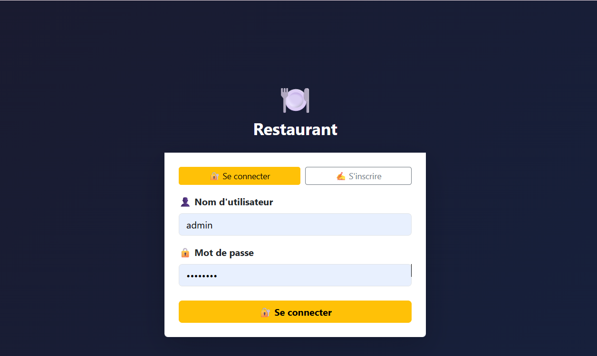
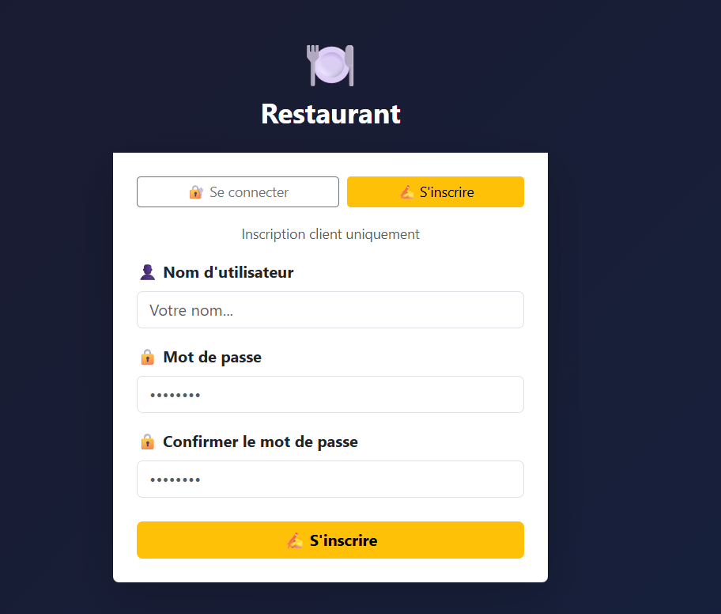

# Projet Angular - Restaurant Management System

Une application web complète pour la gestion d'un restaurant, développée avec Angular (frontend) et Node.js/Express (backend).

## Table des Matières

- [Vue d'ensemble](#vue-densemble)
- [Structure du Projet](#structure-du-projet)
- [Prérequis](#prérequis)
- [Installation](#installation)
- [Démarrage](#démarrage)
- [Architecture](#architecture)
- [Fonctionnalités](#fonctionnalités)
- [API Endpoints](#api-endpoints)
- [Modèles de Données](#modèles-de-données)

## Vue d'ensemble

Ce projet est une plateforme de gestion de restaurant permettant de :
- Gérer les plats et catégories
- Gérer les commandes clients
- Authentification utilisateur
- Upload d'images pour les plats
- Dashboard administrateur
- Interface client pour passer des commandes

## Structure du Projet

```
projet-angular/
├── backend/               # API Node.js/Express
│   ├── src/
│   │   ├── api/
│   │   │   ├── controllers/     # Logique métier
│   │   │   ├── models/          # Schémas de base de données
│   │   │   ├── routes/          # Définition des routes
│   │   │   └── middleware/      # Middlewares (upload, etc.)
│   │   └── database/            # Configuration DB
│   ├── config/                  # Configuration générale
│   ├── uploads/                 # Dossier des uploads d'images
│   ├── package.json
│   └── index.js                 # Point d'entrée
├── frontend/              # Application Angular
│   ├── src/
│   │   ├── app/
│   │   │   ├── components/      # Composants réutilisables
│   │   │   ├── pages/           # Pages de l'application
│   │   │   ├── services/        # Services métier
│   │   │   ├── guards/          # Guards de routage
│   │   │   ├── models/          # Interfaces TypeScript
│   │   │   └── app.routes.ts    # Configuration du routage
│   │   └── environments/        # Configurations d'environnement
│   ├── angular.json
│   └── package.json
└── README.md              # Ce fichier
```

## Prérequis

Avant de commencer, assurez-vous d'avoir installé :
- **Node.js** >= 18.x
- **npm** >= 9.x
- **MongoDB** (en local ou Atlas)
- **Angular CLI** >= 17.x (optionnel, pour le développement frontend)
## Captures d'écran




## Installation

### 1. Cloner le repository
```bash
git clone <your-repo-url>
cd projet-angular
```

### 2. Installation du Backend
```bash
cd backend
npm install
```

### 3. Configuration du Backend
Créez un fichier `.env` dans le dossier `backend/` :
```env
PORT=5000
MONGODB_URI=mongodb://localhost:27017/restaurant
JWT_SECRET=your_jwt_secret_key
NODE_ENV=development
```

### 4. Installation du Frontend
```bash
cd ../frontend
npm install
```

## Démarrage

### Backend
```bash
cd backend
npm start
```

Le serveur démarre sur `http://localhost:5000`

### Frontend
```bash
cd frontend
ng serve
# ou
npm start
```

L'application est accessible sur `http://localhost:4200`

### Avec base de données
Pour initialiser la base de données avec des données de test :
```bash
cd backend
npm run seed
```

## Architecture

### Backend (Express.js)
- **Controllers** : Gèrent la logique métier
- **Models** : Schémas MongoDB pour les données
- **Routes** : Définissent les endpoints API
- **Middleware** : Gestion des uploads et autres middlewares

### Frontend (Angular)
- **Services** : Communiquent avec l'API backend
- **Components** : Éléments réutilisables (header, etc.)
- **Pages** : Vues complètes de l'application
- **Guards** : Protection des routes
- **Models** : Interfaces TypeScript

## Fonctionnalités

### Authentification
- Inscription/Connexion utilisateur
- JWT pour sécuriser les requêtes
- Guards pour protéger les routes

### Gestion des Plats
- CRUD complet pour les plats
- Upload d'images
- Catégorisation des plats
- Affichage du catalogue

### Gestion des Commandes
- Création de commandes
- Suivi des commandes
- Historique des commandes utilisateur
- Dashboard administrateur

### Gestion des Catégories
- Création/modification des catégories
- Filtrage par catégorie

## API Endpoints

### Authentification
- `POST /api/auth/login` - Connexion
- `POST /api/auth/register` - Inscription

### Plats
- `GET /api/plats` - Liste tous les plats
- `GET /api/plats/:id` - Détail d'un plat
- `POST /api/plats` - Créer un plat (admin)
- `PUT /api/plats/:id` - Modifier un plat (admin)
- `DELETE /api/plats/:id` - Supprimer un plat (admin)

### Catégories
- `GET /api/categories` - Liste les catégories
- `POST /api/categories` - Créer une catégorie (admin)
- `PUT /api/categories/:id` - Modifier une catégorie (admin)
- `DELETE /api/categories/:id` - Supprimer une catégorie (admin)

### Commandes
- `GET /api/commandes` - Liste les commandes
- `GET /api/commandes/:id` - Détail d'une commande
- `POST /api/commandes` - Créer une commande
- `PUT /api/commandes/:id` - Modifier une commande
- `DELETE /api/commandes/:id` - Supprimer une commande

## Modèles de Données

### User (Utilisateur)
```typescript
{
  _id: ObjectId,
  email: string,
  password: string (hashée),
  nom: string,
  role: 'user' | 'admin',
  dateCreation: Date
}
```

### Plat (Dish)
```typescript
{
  _id: ObjectId,
  nom: string,
  description: string,
  prix: number,
  categorie: ObjectId (référence Categorie),
  image: string (URL ou chemin),
  dateCreation: Date
}
```

### Categorie (Category)
```typescript
{
  _id: ObjectId,
  nom: string,
  description: string,
  dateCreation: Date
}
```

### Commande (Order)
```typescript
{
  _id: ObjectId,
  utilisateur: ObjectId (référence User),
  plats: [
    {
      plat: ObjectId (référence Plat),
      quantite: number,
      prixUnitaire: number
    }
  ],
  totalPrice: number,
  statut: 'en attente' | 'en cours' | 'livrée',
  dateCommande: Date
}
```

## Sécurité

- Authentification JWT
- Passwords hashés (bcrypt)
- Validation des entrées
- CORS configuré
- Protection des routes admin
## Auteur

Eya Iben Radhouane 
